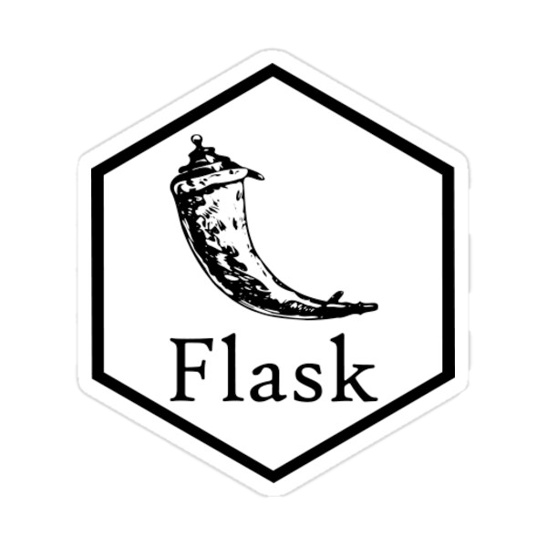

<h1 style='text-align:center'>Hi I'm Tony</h1>

<!-- GIT, LINKEDIN, MEDIUM, GMAIL ICONS -->

<a href="mailto:tonyeder11@gmail.com?subject=Hey I was looking at your github profile and [you take it from here]" target="_blank">

<h2><em>💪 Software Engineer in Training 💪</em></h2>

<!-- TECH STACK -->
<!-- JAVASCRIPT, REACT, PYTHON, FLASK, ALEMBIC, FLASK-RESTFUL, SQL, SQLITE, LINUX, SQLALCHEMY, HTML5, CSS3, BOOTSTRAP -- ICONS-->
# 💻 TECH STACK 💻
<!-- 
 -->

    
    
    
    
    
    
    
    
    

<!-- personal notes about me: -->

🧑‍🎓 I am currently a student in the Software Engineering program at Flatiron School

💡 The decision to learn how to program has been one of the best, if not the best, of my career.

🙋‍♂️ I am eager to collaborate, review, and network. ✌️ 

🌞 I am actively seeking assistance/mentoring in my pursuit of a new developer role.

<!-- PROJECT DEMOS
LINKS TO TOP THREE OR FOUR -->

<b>Pronouns</b>

He/Him/His

<!-- 
<b>One more note...</b>
 -->
